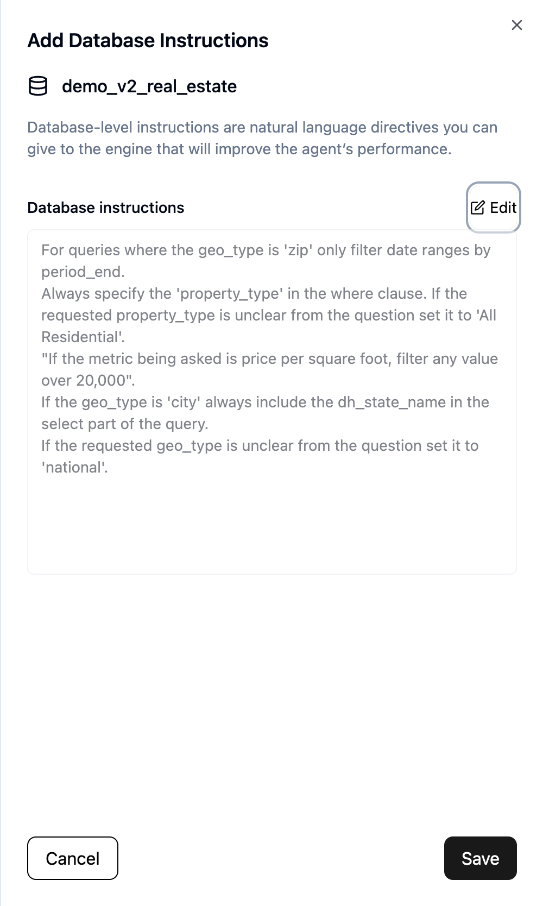
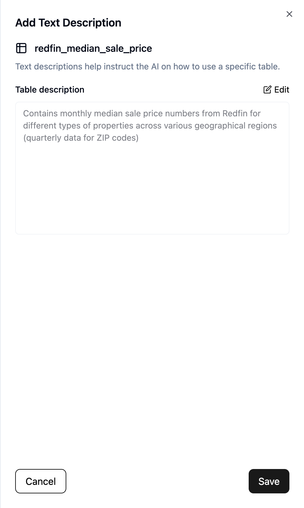
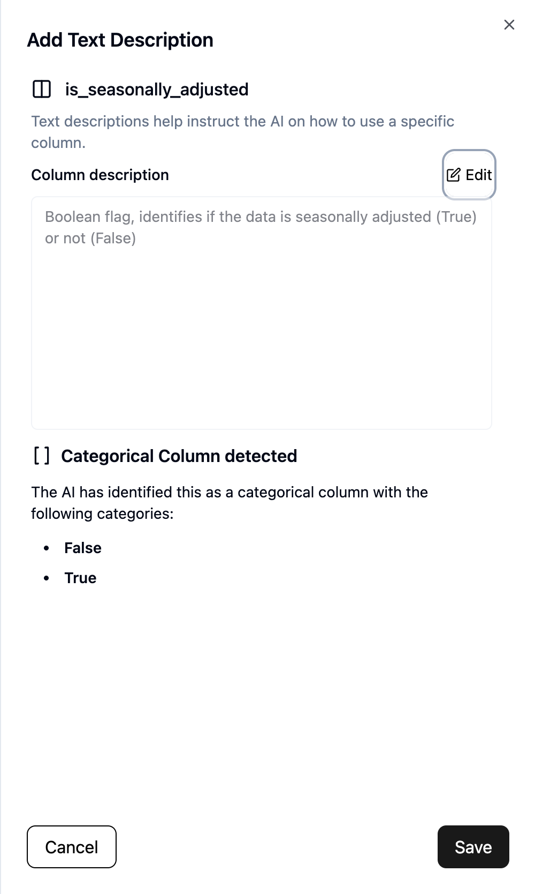

Add Business Context
====================

Data administrators are responsible for providing relevant context to the AI 
tool, such as:

* :ref:`db-instructions`
* :ref:`table-descriptions`
* :ref:`column-descriptions`

.. _db-instructions:

Database instructions
---------------------

The AI tool learns how to write more accurate queries as the number of verified 
queries increases. However, there are some organizational definitions of data 
that are more difficult to learn. For example:

* When identifying sales in your dataset, you may need to group by multiple unexpected columns, such as **store_id** and **sale_date**.
* When dealing with aggregate data for departments within your org, you may want to always sort by a particular column.
* The **transaction_date** column may always need to filter certain date ranges out.

Instructions like these help improve the quality of generate queries more 
quickly and effectively than golden records. To add these instructions:

#. Click on the database name in the :ref:`databases-tab`. A side-tab titled "Add Database Instructions" will pop up on the right.
#. Click on the "Edit" button. The text box will now be editable.
#. Add or update the instructions. Add each separate instruction on its own line.
#. Click on "Save". After a few seconds, the following message should appear: *Database instructions updated*

.. _table-descriptions:

Table descriptions
------------------

Each table should have a human-readable text description that the Dataherald AI 
tool would use to identify the correct table to answer certain questions. Below 
are a few examples:

* **Users table**: A table containing all user profile information. Includes name identifiers (first and last), demographic info, personnel data, etc.
* **Sales table**: Captures all transactions made in store or on our website. Contains foreign keys (*item_id*) to our **org.items** table.

To add or update a table description:

#. Click on the table name in the :ref:`databases-tab`. A side-tab titled "Add Text Description" will pop up on the right.
#. Click on the "Edit" button. The text box will now be editable.
#. Add or update the table description.
#. Click on "Save". After a few seconds, the following message should appear: *<table> description updated*

.. _column-descriptions:

Column descriptions
-------------------

Similar to tables, all columns should also have a human-readable text 
description that can be used to identify columns that would be relevant to 
answering certain questions. Below are a few examples:

* **customer_id column**: Identifier used as primary key for our customers. Random 16-character alphanumeric code, should be used to join with the **org.sales** table.
* **cost column**: The cost of the item per unit. Should be multiplied by the **quantity** column to get a total cost value.

The view optionally also identifies other metadata about the column. For 
example, some columns are identified as categorical. In those situations, the 
view will include that detection, along with a list of values from that column.

To add or update a column description:

#. Click on the column name in the :ref:`databases-tab`. A side-tab titled "Add Text Description" will pop up on the right.
#. Click on the "Edit" button. The text box will now be editable.
#. Add or update the column description.
#. Click on "Save". After a few seconds, the following message should appear: *<column> description updated*

