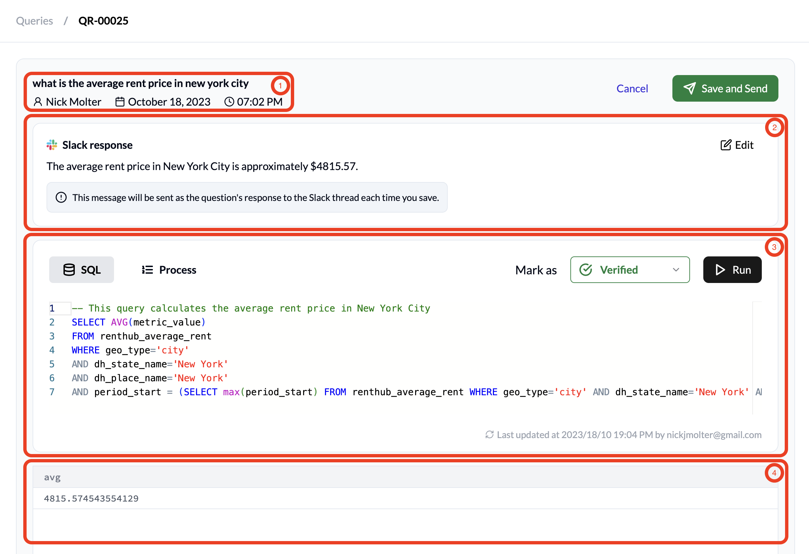
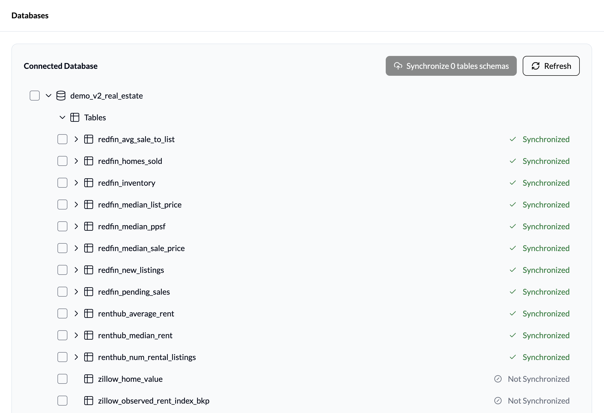
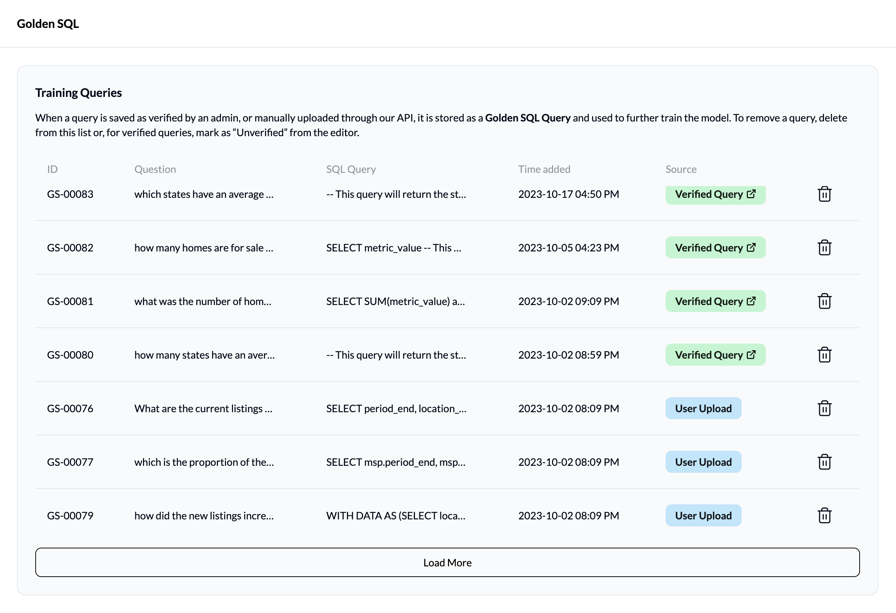

Admin Console Overview
======================

.. _queries-tab:

Queries Tab
-----------
This UI shows all of the questions asked through the Slackbot. For each question, the tab displays:

* **Query ID**: The identifier for the question
* **User**: The name of the person who asked the question
* **Question**: The question asked
* **Answer**: The natural language answer generated by the tool
* **Time**: When the question was asked
* **Status**: The current status of the question

  * **Verified**: Checked by a data admin, query verified, response sent to user
  * **High Confidence** / **Medium Confidence** / **Low Confidence**: No response sent, needs validation by data admin
  * **SQL Error**: SQL query failed to generate due to error, please contact your Dataherald technical support

Once you click on a row in the displayed table, the following view opens up.

#. **Header**: Question asked, User that asked it, and the Time of the request
#. **Slack response panel**: Contains the NL response generated to the user's question.
#. **SQL text editor**: Generated SQL query, and a Process sub-tab outlining the logic of the AI agent
#. **Results panel**: Result of the SQL query, along with natural language response generated

.. _databases-tab:

Databases Tab
-------------
This tab displays information about the database connection that Dataherald AI is currently using, along with the tables it has scanned for use to answer user’s questions.

.. _golden-queries-tab:

Golden Queries Tab
------------------
All of the questions with verified, or “golden”, SQL queries are shown in this tab. For each verified query, the tab displays:

* **ID**: The identifier for the golden query (separate from the Query ID)
* **Question**: The question asked
* **SQL Query**: The verified query used to answer the question
* **Time added**: When the query was verified by the data admin
* **Source**: Link to the query in the Queries tab if it’s verified through the app in response to a user question, otherwise it’ll say “User Upload”

