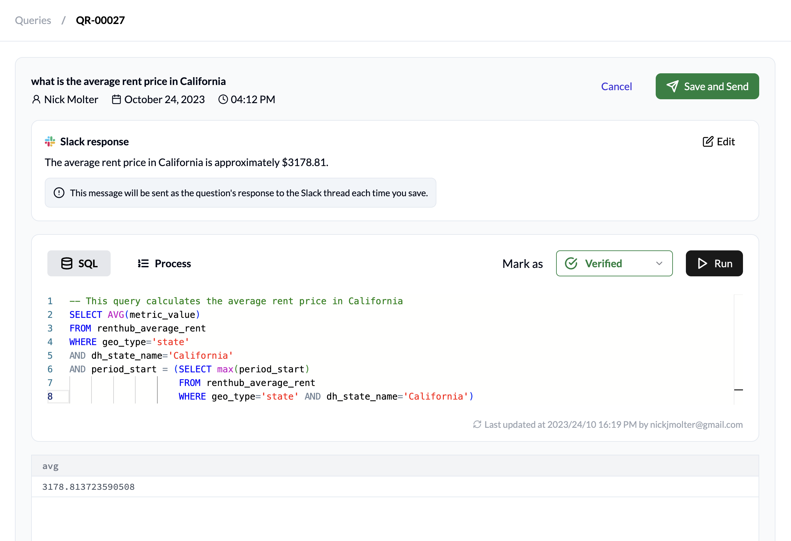

Validate User Queries
=====================

Golden SQLs (or golden queries) are used by the AI model to generate more 
accurate SQL queries in response to questions asked by users. Generally, the 
more golden queries provided, the better the tool gets at answering questions 
in one shot.

Golden queries can be added in two different ways: admins can 
:doc:`add-golden-sqls` or follow the below steps to validate user queries.

Steps
-----

When users ask questions to the Dataherald AI app through Slack, the question 
is captured in the admin console and queued for review by a data admin. Once 
reviewed (the data admin may choose to make changes to the query or the natural 
language response generated), the data admin has the option of marking the SQL 
as Verified. This would register the query as a Golden Query in the 
:ref:`golden-sql-tab` and be used to train the AI to produce better one-shot 
results in the future.

#. Once a user asks a question through the Dataherald AI Slackbot, it will show up on the admin console (the list is sorted by the *Time* column by default, so the latest questions will be on top). It will have one of the following statuses: High Confidence, Medium Confidence, Low Confidence, or SQL Error.
#. The data admin should click on the row, opening up the detailed view.
#. The SQL query generated to answer the question will be in the **SQL text editor**, with the question asked listed above in the **Header**. Data admins can copy-paste it in the execution context of their data warehouse to test it, or fix the query right there in the editor and run it.

   * Please follow the Best Practices for Writing SQL Queries to more effectively train the SQL generator.
   * After running the query, the natural language response generated will automatically appear in the **Slack response panel**.

#. Once the data admin is satisfied with the query and response, the data admin can Mark as Verified and click on “Save”. This will save the query as a Golden Query and will be used to improve the quality of future generated queries. A response will be sent to the user who asked the question through the Slackbot.

